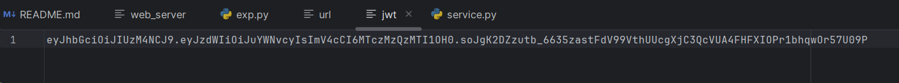
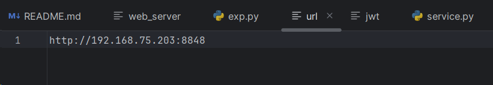
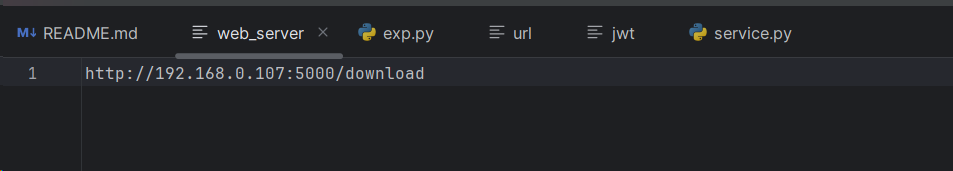
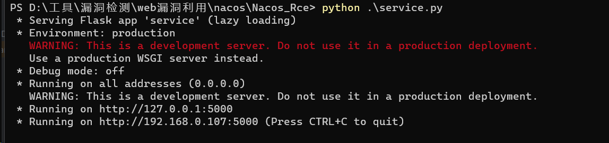
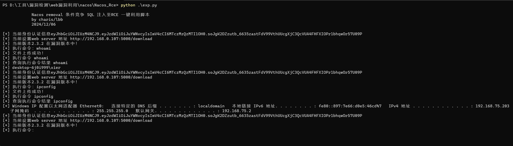
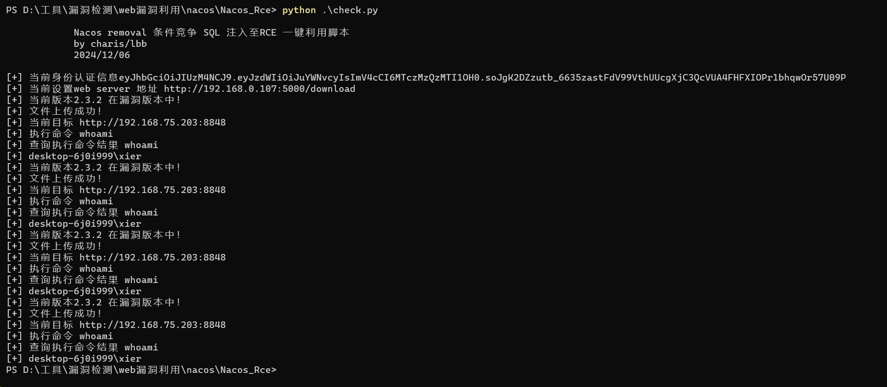

# Nacos_Rce

对网传exp代码进行了如下
* 对报错信息进行了优化处理
* 新增版本检查
* 增加交互性是命令
* 细节可视化
* 新增批量检查
* 支持对认证或未授权的nacos系统进行检查

## 如何使用

当前脚本有三个配置文件分别为```jwt``` ```url``` ```web_server``` 分别为配置 ``` jwt ``` 配置 ```url ``` 配置 ```web_server```








首先启动web服务器



使用exp脚本,会进入半交互状态



使用check默认会执行whoami命令




### 关注公众号获取更多安全知识


